# _MCU-8051_


---

## Sumário

- [Histórico de Versão](#histórico-de-versão)
- [Resumo](#resumo)
- [Links para estudos](#links-para-estudos)
- [Fluxograma](#fluxograma)
    - [Configuração do Gravador USBASP](#configuração-do-gravador-usbasp)
    - [ATMEL AT89S52](#atmel-at89s52)
- [Pinos do projeto eletrônico](#pinos-do-projeto-eletrônico)
    - [Display 7 segmentos](#display-7-segmentos)
- [Configuração do simulador](#configuração-do-simulador)
    - [Instalação de Software](#instalação-de-software)
    - [Configuração de simulador](#configuração-de-simulador)
- [Bibliotecas](#bibliotecas)
- [Configuração do Firmware](#configuração-do-firmware)
    - [Adicionando a Biblioteca ao Projeto](#adicionando-a-biblioteca-a-projeto)
- [Informações](#informações)

## Histórico de Versão

| Versão | Data       | Autor       | Descrição         |
|--------|------------|-------------|-------------------|
| 1.0.0  | 03/07/2025 | Adenilton R | Início do Projeto |

## Resumo

O firmware controla um display de 7 segmentos com três dígitos, utilizando multiplexação. Ele configura os pinos dos segmentos (a, b, c, d, e, f, g, ponto decimal) e os pinos de controle dos dígitos (Q1, Q2, Q3) como saídas. O código exibe números decimais no display, incluindo um ponto decimal, com suporte para até duas casas decimais. A multiplexação alterna rapidamente entre os dígitos para criar a ilusão de que todos estão sendo exibidos simultaneamente. O firmware é otimizado para rodar em microcontroladores, configurando corretamente os registros de controle (PORT e TRIS).

## Links para estudos

[Informações do ATMEL AT89S52;](https://www.microchip.com/en-us/product/at89s52)

[Datasheet do microcontrolador;](https://ww1.microchip.com/downloads/en/DeviceDoc/doc1919.pdf)

[Vídeo de configuração do ambiente;](https://www.youtube.com/watch?v=QY_adW902Uw&t)

[Site de compra do ATMEL AT89S52;](https://www.saravati.com.br/microcontrolador-at89s52-24pu-dip-40-pin.html)

[Datasheet do display.](https://cdn.awsli.com.br/945/945993/arquivos/5611BH-XILTX.pdf)

## Fluxograma

### Configuração do Gravador USBASP

USBasp é um gravador para controladores Atmel AVR com uma conexão USB construída em sua placa. É constituído de um ATMega8 e outros simples componentes eletrônicos. O gravador apenas utiliza de um driver USB para comunicação, não sendo necessário um controlador USB especial.

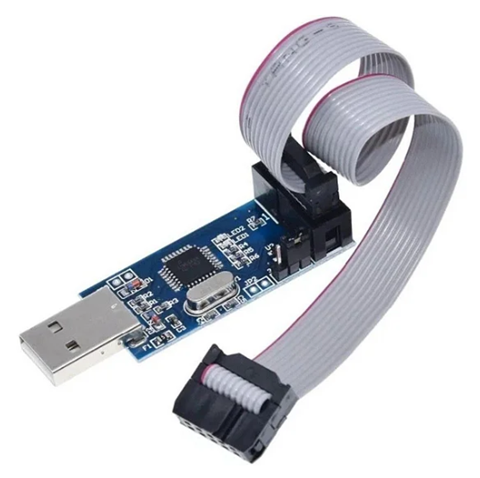

Esquemático eletrônico:


**Informações Técnicas:**

- **`Funciona em diversos sistemas operacionais:`** Linux, Mac OS X e Windows (32 e 64 Bits);
- Permite a leitura ou escrita na EEPROM do microcontrolador, firmware, fuse bits e lock bits;
- Velocidade de programação é maior que 5kBytes/seg;
- Opção de modo lento SCK para alvos com baixo clock (<1.5Mhz);
- Interface ISP 10 pinos;
- Dimensões: 7cm x 2cm;

Para atualizar o software, baixe o [**`ZADIG-2.9`**](https://github.com/pbatard/libwdi/releases/tag/v1.5.1) e siga o passo a passo para a atualização no [**`USBASP`**](https://www.instructables.com/USBASP-Installation-in-Windows-10/).

Para o software de gravação, assista ao vídeo [**`Como gravar um 8051 com USBASP`**](https://www.youtube.com/watch?v=EKlpHcpSUzQ) e baixe o arquivo no [**`AVR ProgISP Programmer`**](https://github.com/ioelectro/avr-progisp-programmer).

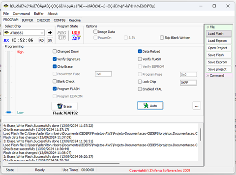

### ATMEL AT89S52

O **AT89S52** é um microcontrolador de 8 bits de baixo consumo de energia e alto desempenho, com 8 KB de memória Flash programável internamente. Fabricado pela Atmel, é compatível com o conjunto de instruções e a pinagem padrão da arquitetura 8051. Ele permite reprogramação no sistema ou através de um programador externo.

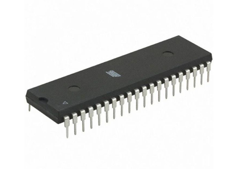

Esquemático eletrônico:

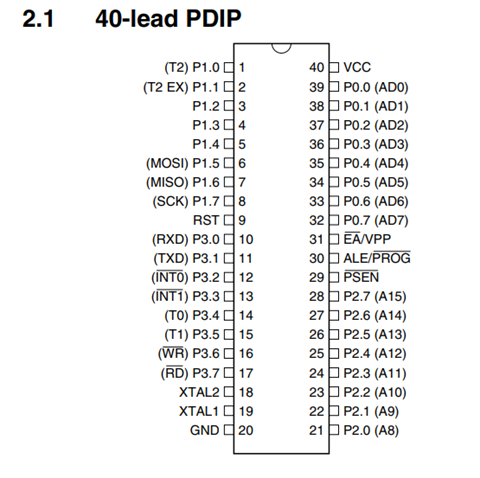

**Informações Técnicas:**

- `Modelo:` AT89S52-24PU DIP 40 Pin;
- `Encapsulamento:` PDIP 40 Pin (Plastic Dual In line Package);
- `Terminais:` 40 pinos;
- `Faixa de Operação de`: 4,0 V a 5,5 V;
- `Memória Flash:` 8 KB de memória flash programável (para armazenagem de código);
- `Memória RAM:` 256 Bytes;
- `Tipo de Memória:` EEPROM;
- `Clock:` 0 Hz a 33 MHz;
- Interface serial de comunicação (UART);
- `Corrente de saída:` 15 mA;
- `Entradas e saídas digitais:` 32 divididas em 4 ports de 8 bits cada;
- Dois temporizadores/contadores de 16 bits;
- `Durabilidade:` 10.000 ciclos de gravação/apagamento;
- `Temperatura de operação:` -40 a 85 Graus Celsius;
- `Cor:` Preto;
- `Tamanho:` 55mm Largura x 15mm Profundidade x 4mm Altura;
- `Peso:` 5g;

## Pinos do projeto eletrônico

Display 7 segmentos.

| Nome      | Pino |
|-----------|------|
| a         | RB0  |
| b         | RB1  |
| c         | RB2  |
| d         | RB3  |
| e         | RB4  |
| f         | RB5  |
| g         | RB6  |
| . (Ponto) | RB7  |

Transistor para C.K.

| Nome | Pino |
|------|------|
| Q1   | RA0  |
| Q2   | RA1  |
| Q3   | RA2  |

### Display 7 segmentos

O Display de 7 segmentos Catodo Comum é um display de LED composto por 7 segmentos e um ponto decimal de LED catodo comum.

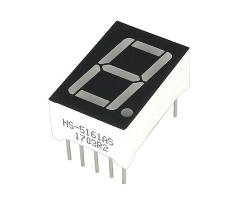

Esquemático eletrônico:

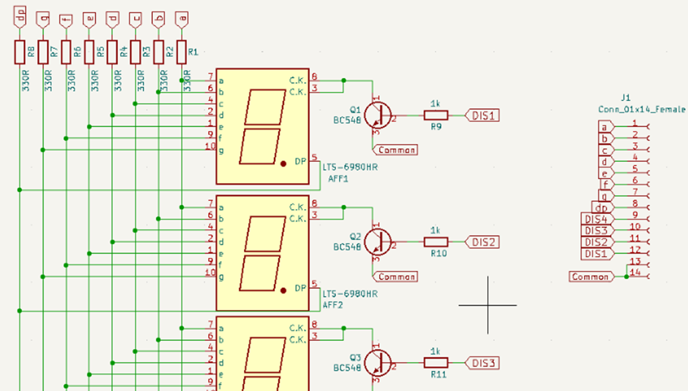

**Informações Técnicas:**

- `Modelo:` HS-5161AS;
- `Marca:` OEM;
- `Tensão de Operação:` 5V DC;
- `or dos LEDs:` Vermelho;
- `1 dígito com ponto decimal;`
- `Polaridade:` Cátodo comum;
- `Tamanho do dígito:` 0,56 "(14,2 mm);
- `Tamanho do módulo:` Largura 12,6 mm, Comprimento 19 mm, Altura 8 mm;
- `Cor do segmento ligado:` vermelho;
- `Cor do segmento desligada:` branco;
- `Cor da superfície frontal:` preto;
- `Tensão típica (Vf):` 1,8 V;
- `Tensão reversa máxima:` 5 V;
- `Corrente máxima do segmento:` 20 mA continuamente;
- `Corrente operacional recomendada por segmento:` 12 mA;
- `Composição:` Metal, Plástico, Placa de Fenolite, Componentes Eletrônicos;
- `Origem:` China;
- `amanho:` 12,6mm Largura x 19mm de Comprimento x 8mm de Altura;
- `Peso:` 2.2g;

**Documetação:**

[Site para compra do componente.](https://www.saravati.com.br/display-7-segmentos-catodo-comum-hs-5161as-vermelho.html)

[Datasheet do display.](https://cdn.awsli.com.br/945/945993/arquivos/5611BH-XILTX.pdf)

[Informações simulador.](https://lcgamboa.github.io/picsimlab_docs/0.9.2/7SegmentsDisplay.html#x98-1010009.3.1)

## Configuração do simulador

Este documento visa fornecer orientações para a instalação dos softwares necessários, incluindo o MPLAB X IDE v6.20, o Compilador XC8 2.46 e o Simulador PICSimLab 0.9.1, bem como para a configuração do microcontrolador na IDE MPLAB X.

### Instalação de Software

💡 [**Para mais detalhes de instalação dos software;**](https://github.com/AdeniltonR/Exemplos-de-firmware-para-PIC)

💡 [**Para mais detalhes de configuração do microcontrolador;**](https://github.com/AdeniltonR/Exemplos-de-firmware-para-PIC/tree/main/Familia%20PIC/PIC18F47K40)

### Configuração de simulador

💡 [**Para baixar e instalar PICSimLab;**](https://github.com/AdeniltonR/Exemplos-de-firmware-para-PIC?tab=readme-ov-file#instala%C3%A7%C3%A3o-picsimlab)

Inicie o software `PICSimLab` e, em seguida, clique em `Board` e selecione `Breadboard`:

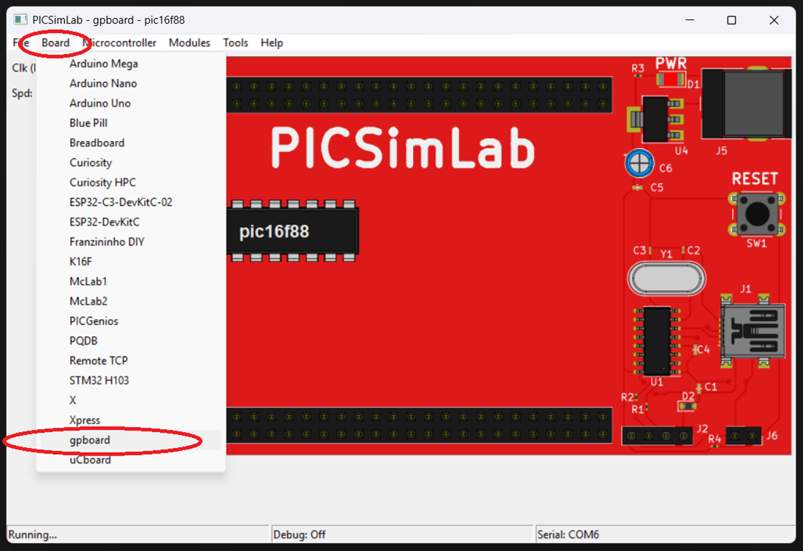

Em seguida, vá até a opção `Microcontroller` e selecione o `PIC16F88` na lista disponível:

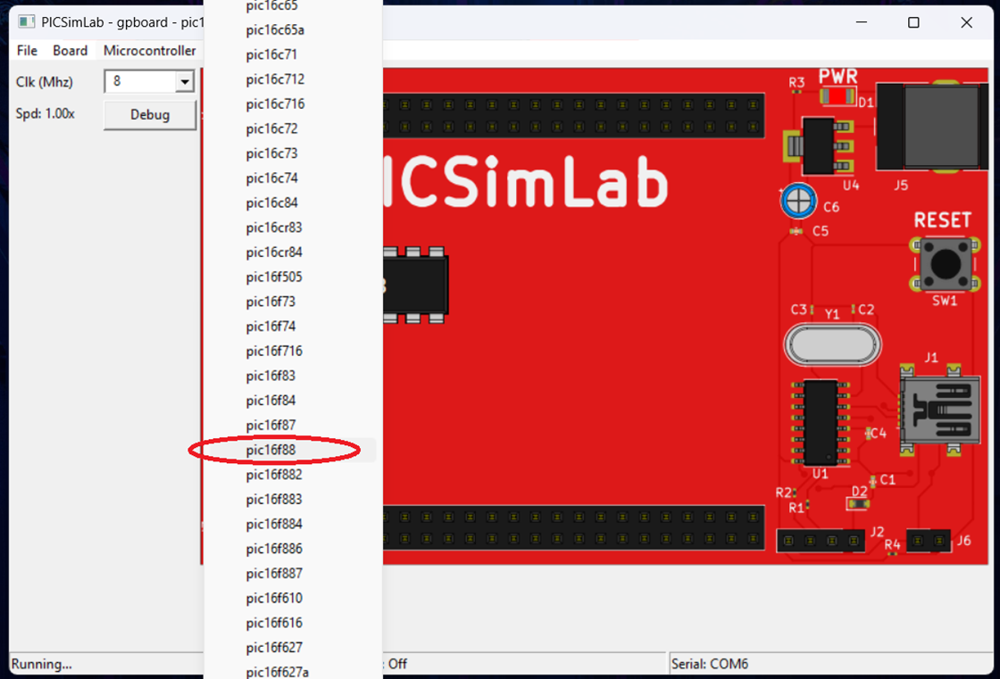

Em seguida, vá até opcão `Clk(Mhz)` e selecione `8 Mhz`:

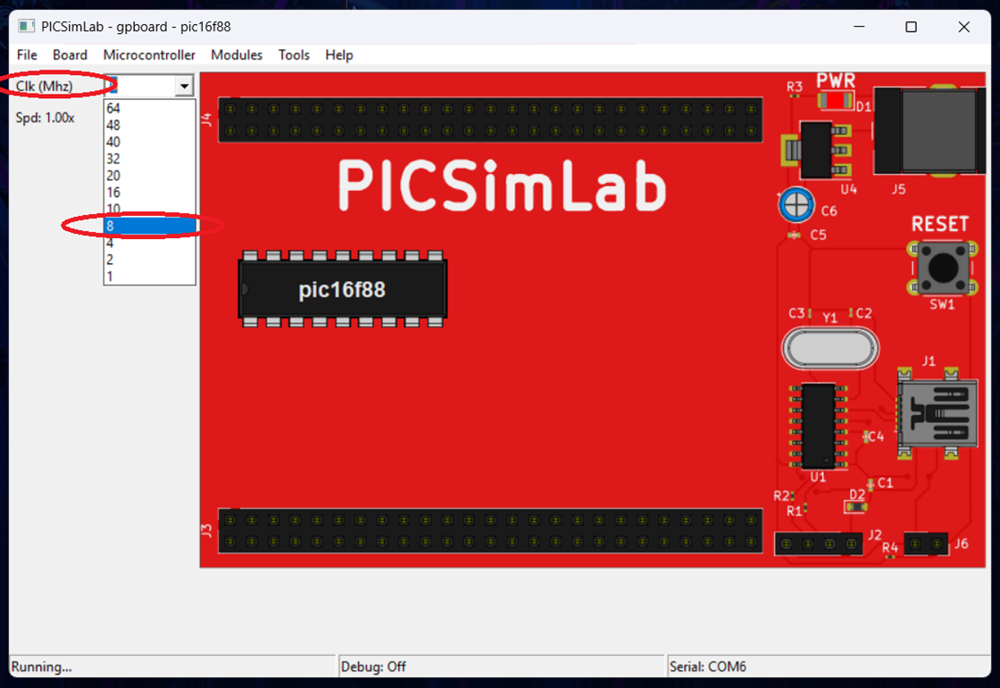

Em seguida, vá até opção `Modules/Spare parts` e selecione `7Segments Display (Decoder)`:

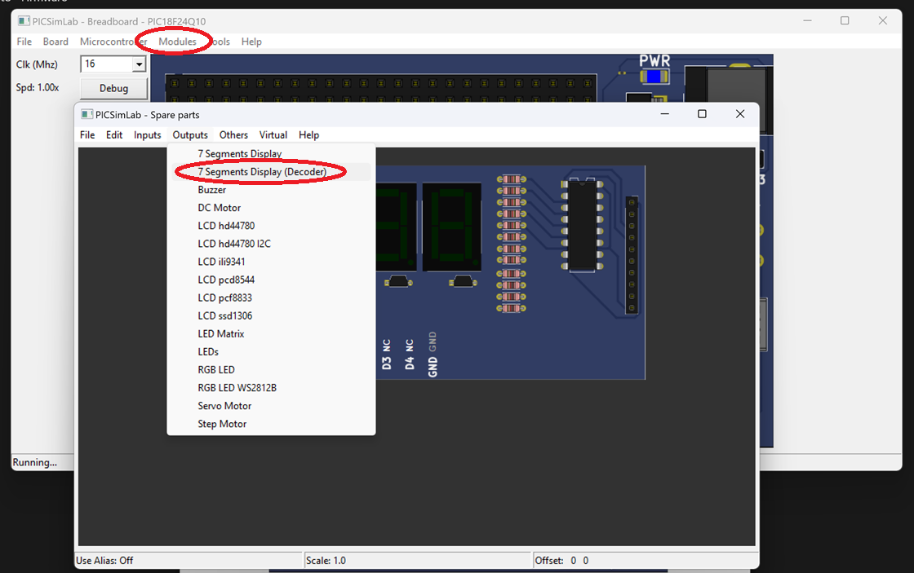

Em seguida, clique com botão direito em cima do display e vá até opção `Properties`:

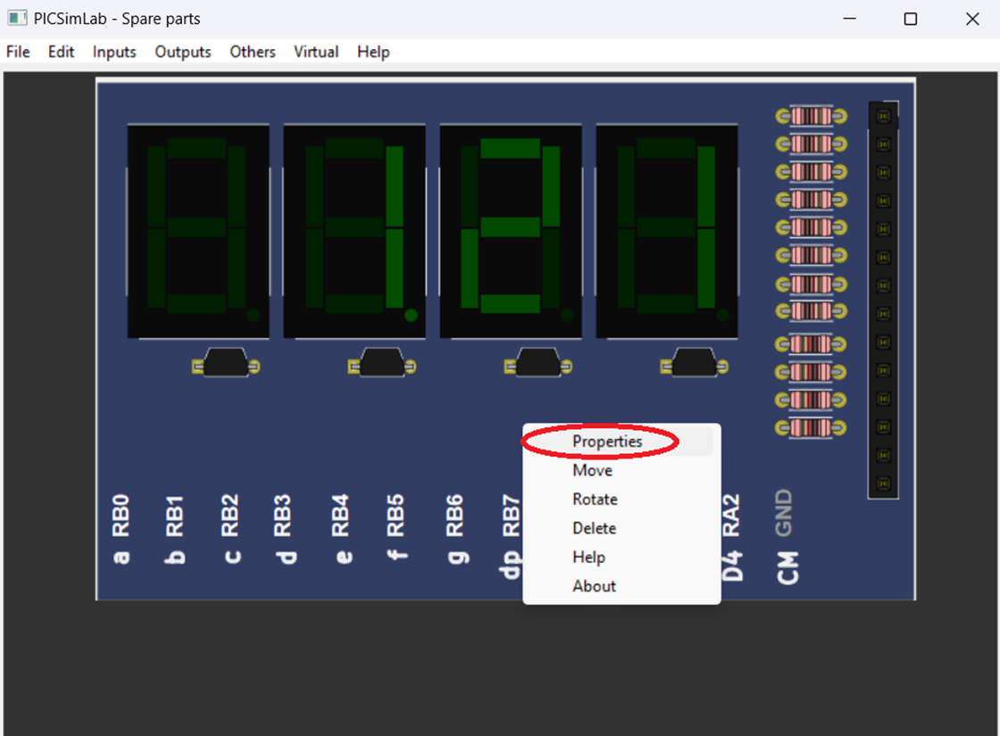

Em seguida, configure os pinos do display:

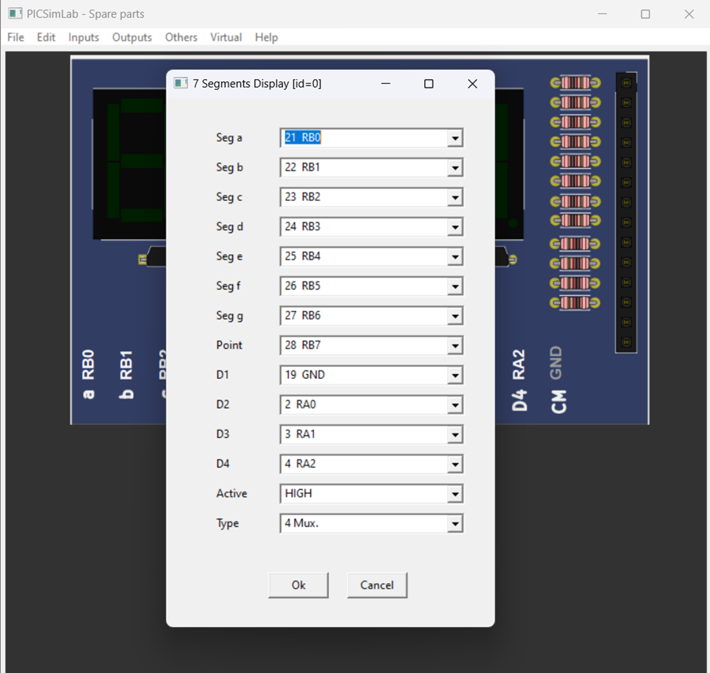

Em seguida, vá até opcão `File` e selecione `Load Hex`:

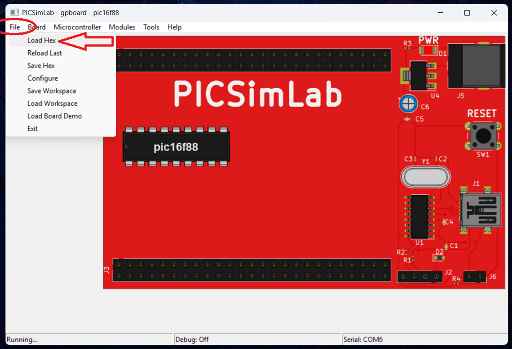

Depois disso, navegue até o local onde seu projeto está salvo e selecione a pasta `Seu-projeto/dist/default/production` para abri-la. E selecione o arquivo `.hex`, que provavelmente estará nomeado como `Seu-projeto.hex`, e clique para abrir:

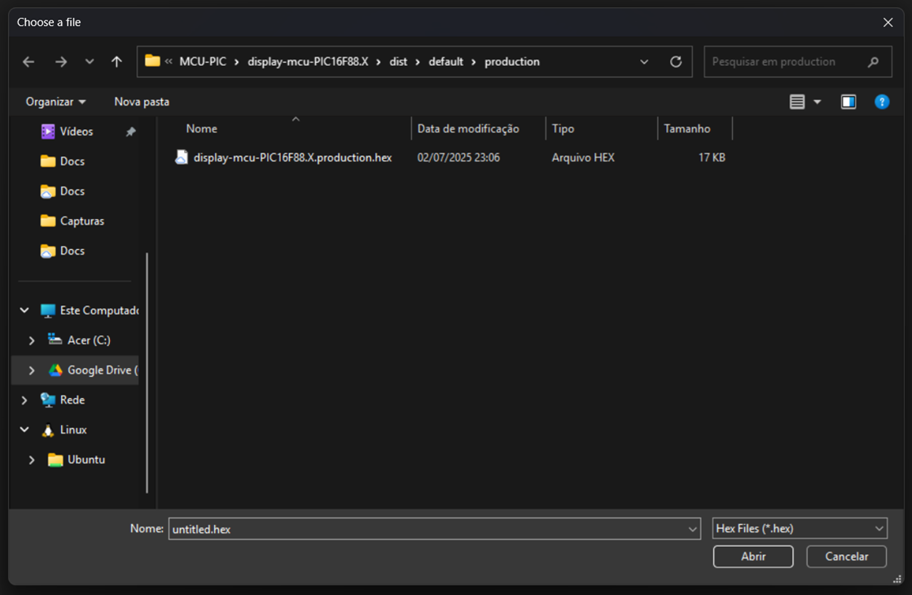

Se tudo estiver configurado adequadamente, o `display de 7 segmetos` é para funiconar:

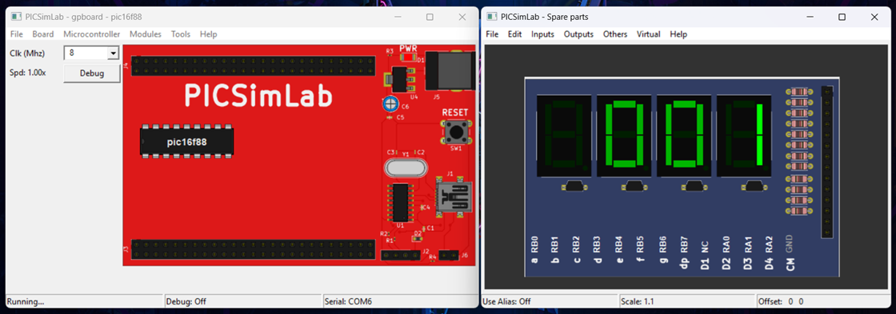

PICSimLab já esta configurado para poder usar, aqui;

[Display-7.pzw](Simulador/Display-7.pzw)

[Display-7.pcf](Simulador/Display-7.pcf)

## Bibliotecas

A biblioteca foi projetada para controlar um display de 7 segmentos com três dígitos, exibindo números decimais. Ela é composta por funções que inicializam o display, limpam os dígitos, e exibem valores. A multiplexação é usada para alternar entre os três dígitos, de modo que o display pareça mostrar os três dígitos simultaneamente.

1. **`void display_inicializar(void)`**
    
    Esta função é responsável por configurar o hardware do display de 7 segmentos. Ela define os pinos dos segmentos (a, b, c, d, e, f, g e ponto) e dos dígitos (Q1, Q2, Q3) como saídas. Isso é feito para garantir que os pinos corretos possam ser utilizados para controlar o display. Além disso, o display é inicializado apagando todos os dígitos.
    
    Exemplo de uso:
    
    ```c
    display_inicializar();
    ```
    
2. **`void display_limpar(void)`**
    
    Esta função apaga qualquer valor atualmente exibido no display. Ela desliga todos os segmentos e os dígitos, fazendo com que o display fique em branco. É útil para garantir que nenhum valor residual permaneça no display antes de exibir um novo número.
    
    Exemplo de uso:
    
    ```c
    display_limpar();
    ```
    
3. **`void display_exibir_numero(int numero)`**
    
    Esta função exibe um número inteiro no display de 7 segmentos. O número fornecido é separado em dígitos (unidades, dezenas, centenas, etc.), e cada dígito é exibido em uma posição específica do display através de multiplexação. Ela é ideal para exibir valores inteiros, sem casas decimais.
    
    Exemplo de uso:
    
    ```c
    display_exibir_numero(123);
    ```
    
4. **`void display_exibir_digito(uint8_t digito, uint8_t posicao)`**
    
    Esta função exibe um único dígito em uma posição específica do display. Ela é usada internamente pelas outras funções para controlar qual dígito aparece em qual posição. A função converte o número fornecido para o padrão de segmentos correspondente e o ativa na posição desejada.
    
    Exemplo de uso:
    
    ```c
    display_exibir_digito(5, 1);  // Exibe o número 5 na posição 1
    ```
    
5. **`void display_exibir_decimal(float numero)`**
    
    Esta função exibe um número decimal no display de 7 segmentos. Ela separa a parte inteira e a parte decimal do número e exibe ambas no display. O ponto decimal é ativado entre as casas decimais. Ela é ideal para exibir valores com uma ou duas casas decimais.
    
    Exemplo de uso:
    
    ```c
    display_exibir_decimal(12.34);
    ```
    

## Configuração do Firmware

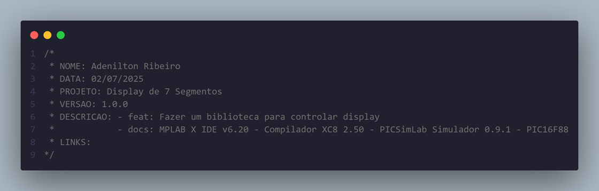

Essas funções trabalham juntas para permitir que você exiba tanto números inteiros quanto decimais. Aqui está um exemplo simples de como usar essas funções em um projeto:

```c
void main(void) {
    // Inicializa o display
    display_inicializar();

    // Exibe um número inteiro
    display_exibir_numero(25);

    // Pausa por alguns segundos
    __delay_ms(2000);

    // Exibe um número decimal
    display_exibir_decimal(1.23);

    while (1) {
        // Loop principal do programa
    }
}
```

### Adicionando a Biblioteca ao Projeto

Para adicionar essa biblioteca ao seu projeto, siga os mesmos passos que expliquei anteriormente:

1. **Arquivo de Cabeçalho (`display7.h`)**: Declare essas funções no arquivo de cabeçalho.
2. **Arquivo de Implementação (`display7.c`)**: Implemente as funções descritas.
3. **Incluir a Biblioteca no Projeto**: No arquivo principal do seu projeto, adicione `#include "display7.h"` para usar essas funções.

## Informações

| Info        | Modelo              |
|-------------|---------------------|
| uC          | AT89S52             |
| Placa       | PICSimlab v0.9.1    |
| Arquitetura | MCS-51              |
| IDE         | MikroC PRO for 8051 |