# _MCU-PIC_


---

## Sumário

- [Histórico de Versão](#histórico-de-versão)
- [Resumo](#resumo)
- [Links para estudos](#links-para-estudos)
- [Fluxograma](#fluxograma)
- [PIC16F88](#pic16f88)
- [Pinos do projeto eletrônico](#pinos-do-projeto-eletrônico)
    - [Display 7 segmentos](#display-7-segmentos)
- [Configuração do simulador](#configuração-do-simulador)
    - [Instalação de Software](#instalação-de-software)
    - [Configuração de simulador](#configuração-de-simulador)
- [Bibliotecas](#bibliotecas)
- [Configuração do Firmware](#configuração-do-firmware)
    - [Adicionando a Biblioteca ao Projeto](#adicionando-a-biblioteca-a-projeto)
- [Informações](#informações)

## Histórico de Versão

| Versão | Data       | Autor       | Descrição         |
|--------|------------|-------------|-------------------|
| 1.0.0  | 02/07/2025 | Adenilton R | Início do Projeto |

## Resumo

O firmware controla um display de 7 segmentos com três dígitos, utilizando multiplexação. Ele configura os pinos dos segmentos (a, b, c, d, e, f, g, ponto decimal) e os pinos de controle dos dígitos (Q1, Q2, Q3) como saídas. O código exibe números decimais no display, incluindo um ponto decimal, com suporte para até duas casas decimais. A multiplexação alterna rapidamente entre os dígitos para criar a ilusão de que todos estão sendo exibidos simultaneamente. O firmware é otimizado para rodar em microcontroladores, configurando corretamente os registros de controle (PORT e TRIS).

## Links para estudos

[Informações do chip.](https://www.microchip.com/en-us/product/pic16f88)

[Datasheet do PIC16F88.](https://ww1.microchip.com/downloads/aemDocuments/documents/MCU08/ProductDocuments/DataSheets/30487D.pdf)

[PICKit3](https://ww1.microchip.com/downloads/en/DeviceDoc/51795B.pdf)

[Datasheet do display.](https://cdn.awsli.com.br/945/945993/arquivos/5611BH-XILTX.pdf)

## Fluxograma

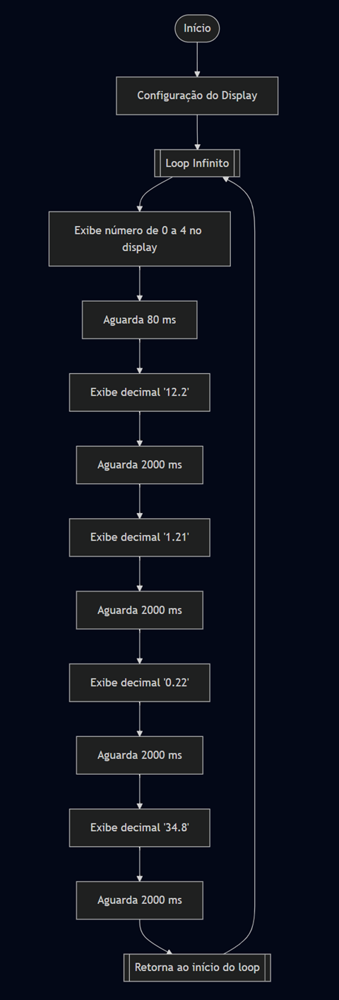

## PIC16F88

O **PIC16F88** é um microcontrolador de 8 bits da família PIC da Microchip, conhecido por sua versatilidade, baixo consumo de energia e custo acessível. Ele oferece recursos como comparadores analógicos, conversor A/D, comunicação serial, e ampla capacidade de configuração dos pinos. É ideal para projetos embarcados de pequeno a médio porte, automação, sistemas de controle e aplicações didáticas.

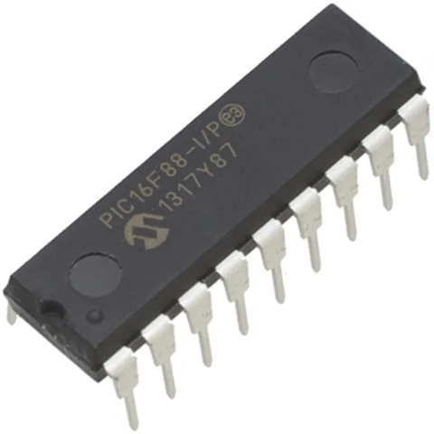

Esquemático eletrônico:

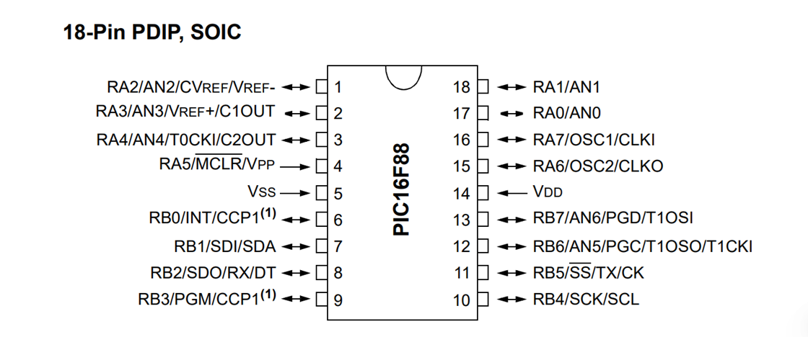

**Informações Técnicas:**

- `Modelo:` PIC16F88-I/P (PDIP 18 pinos);
- `Encapsulamento:` PDIP (Plastic Dual Inline Package) de 18 pinos;
- `Terminais:` 18 pinos;
- `Faixa de Tensão de Operação:` 2,0 V a 5,5 V;
- `Memória Flash:` 7 KB (4096 palavras de 14 bits) programável;
- `Memória RAM:` 368 Bytes;
- `Memória EEPROM:` 256 Bytes de memória não-volátil para dados;
- `Clock:` Até 20 MHz com oscilador externo, 8 MHz com oscilador interno (calibrado);
- `Conversor Analógico-Digital:` 7 canais com resolução de 10 bits;
- `Entradas e Saídas Digitais:` 16 pinos I/O (bidirecionais);
- `Comunicação:` USART (RS232), SPI e I²C;
- `Temporizadores:` 3 timers (Timer0, Timer1, Timer2);
- `Comparadores:` 2 comparadores analógicos;
- `Watchdog Timer:` Sim, com oscilador independente;
- `Programação:` Suporte a programação ICSP (In-Circuit Serial Programming);
- `Durabilidade de gravação:` 10.000 ciclos (Flash);
- `Temperatura de operação:` -40 °C a +85 °C (faixa industrial);
- `Corrente máxima por pino:` ~25 mA (recomendado 20 mA);
- `Consumo em modo sleep:` < 1 µA (típico);
- `Cor:` Preto;
- `Tamanho:` ~22mm x 6mm x 4mm (PDIP);
- `Peso:` ~2g;

## Pinos do projeto eletrônico

Display 7 segmentos.

| Nome      | Pino |
|-----------|------|
| a         | RB0  |
| b         | RB1  |
| c         | RB2  |
| d         | RB3  |
| e         | RB4  |
| f         | RB5  |
| g         | RB6  |
| . (Ponto) | RB7  |

Transistor para C.K.

| Nome | Pino |
|------|------|
| Q1   | RA0  |
| Q2   | RA1  |
| Q3   | RA2  |

### Display 7 segmentos

O Display de 7 segmentos Catodo Comum é um display de LED composto por 7 segmentos e um ponto decimal de LED catodo comum.

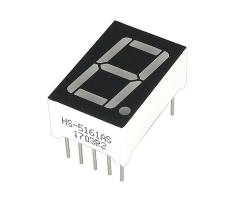

Esquemático eletrônico:

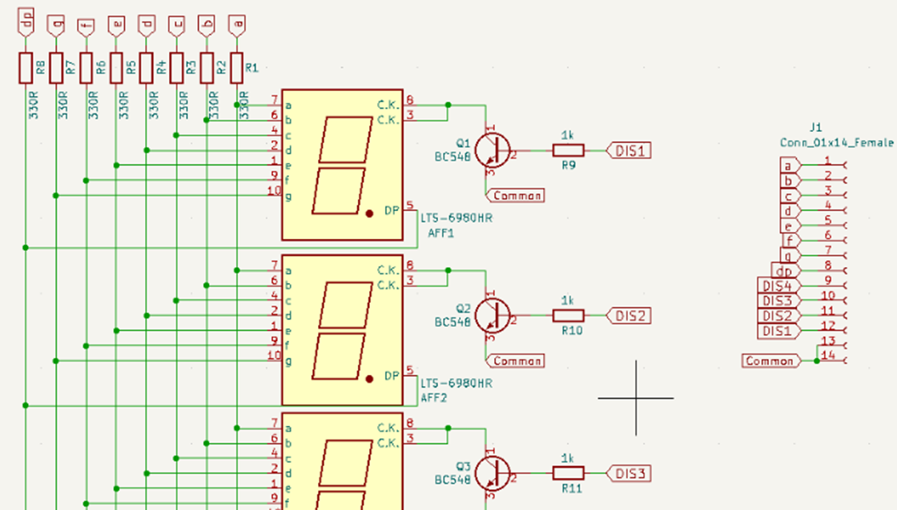

**Informações Técnicas:**

- `Modelo:` HS-5161AS;
- `Marca:` OEM;
- `Tensão de Operação:` 5V DC;
- `or dos LEDs:` Vermelho;
- `1 dígito com ponto decimal;`
- `Polaridade:` Cátodo comum;
- `Tamanho do dígito:` 0,56 "(14,2 mm);
- `Tamanho do módulo:` Largura 12,6 mm, Comprimento 19 mm, Altura 8 mm;
- `Cor do segmento ligado:` vermelho;
- `Cor do segmento desligada:` branco;
- `Cor da superfície frontal:` preto;
- `Tensão típica (Vf):` 1,8 V;
- `Tensão reversa máxima:` 5 V;
- `Corrente máxima do segmento:` 20 mA continuamente;
- `Corrente operacional recomendada por segmento:` 12 mA;
- `Composição:` Metal, Plástico, Placa de Fenolite, Componentes Eletrônicos;
- `Origem:` China;
- `amanho:` 12,6mm Largura x 19mm de Comprimento x 8mm de Altura;
- `Peso:` 2.2g;

**Documetação:**

[Site para compra do componente.](https://www.saravati.com.br/display-7-segmentos-catodo-comum-hs-5161as-vermelho.html)

[Datasheet do display.](https://cdn.awsli.com.br/945/945993/arquivos/5611BH-XILTX.pdf)

[Informações simulador.](https://lcgamboa.github.io/picsimlab_docs/0.9.2/7SegmentsDisplay.html#x98-1010009.3.1)

## Configuração do simulador

Este documento visa fornecer orientações para a instalação dos softwares necessários, incluindo o MPLAB X IDE v6.20, o Compilador XC8 2.46 e o Simulador PICSimLab 0.9.1, bem como para a configuração do microcontrolador na IDE MPLAB X.

### Instalação de Software

💡 [**Para mais detalhes de instalação dos software;**](https://github.com/AdeniltonR/Exemplos-de-firmware-para-PIC)

💡 [**Para mais detalhes de configuração do microcontrolador;**](https://github.com/AdeniltonR/Exemplos-de-firmware-para-PIC/tree/main/Familia%20PIC/PIC18F47K40)

### Configuração de simulador

💡 [**Para baixar e instalar PICSimLab;**](https://github.com/AdeniltonR/Exemplos-de-firmware-para-PIC?tab=readme-ov-file#instala%C3%A7%C3%A3o-picsimlab)

Inicie o software `PICSimLab` e, em seguida, clique em `Board` e selecione `Breadboard`:

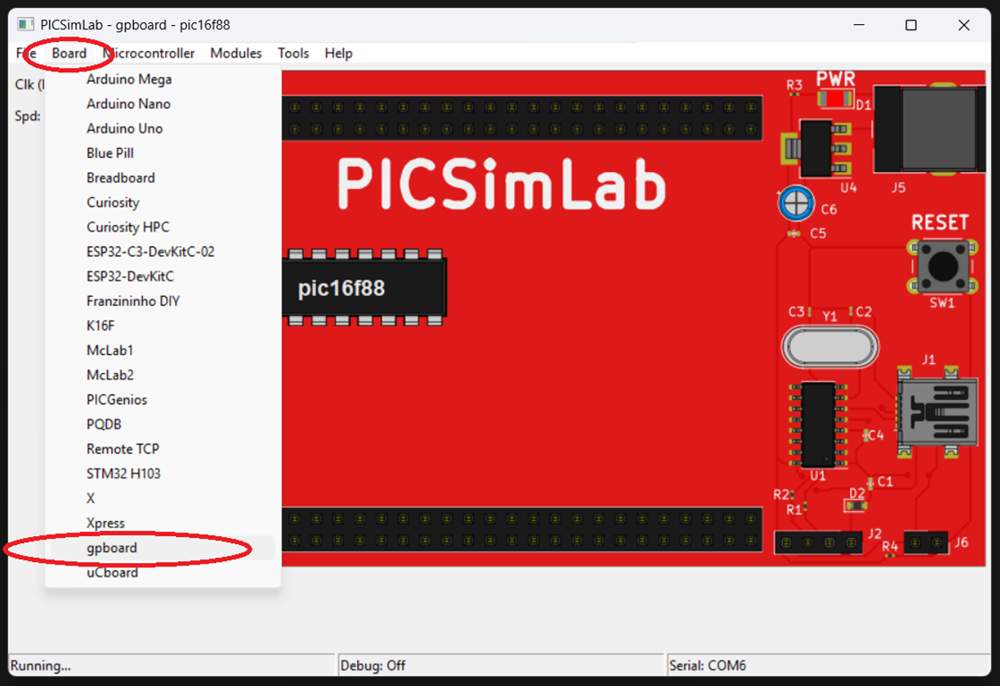

Em seguida, vá até a opção `Microcontroller` e selecione o `PIC16F88` na lista disponível:

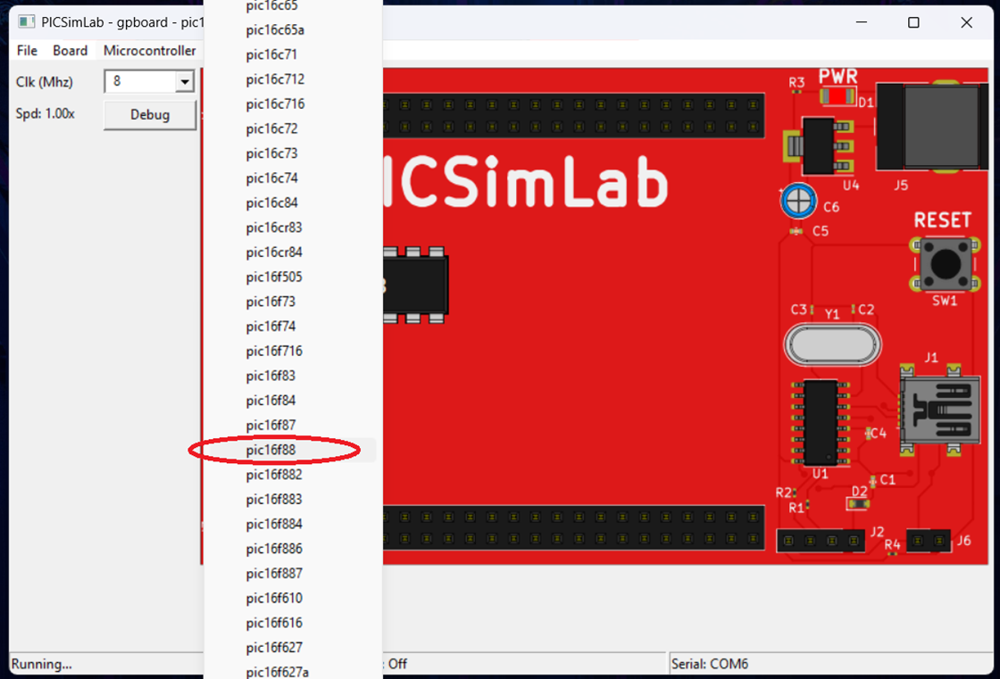

Em seguida, vá até opcão `Clk(Mhz)` e selecione `8 Mhz`:

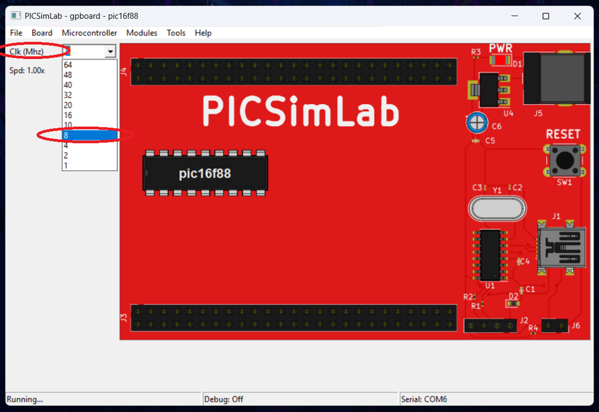

Em seguida, vá até opção `Modules/Spare parts` e selecione `7Segments Display (Decoder)`:

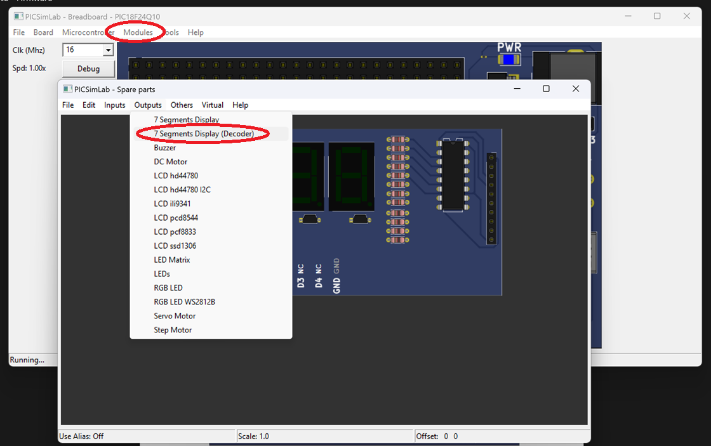

Em seguida, clique com botão direito em cima do display e vá até opção `Properties`:

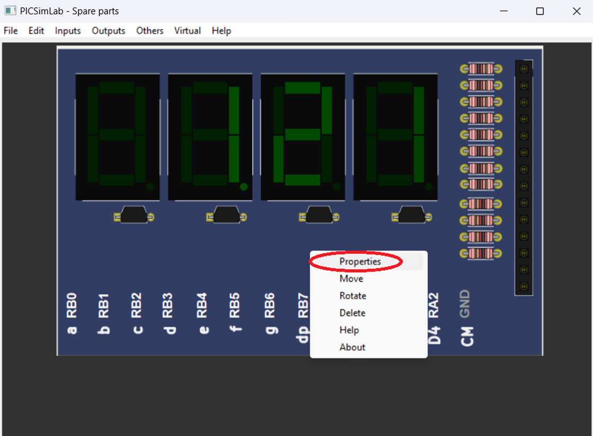

Em seguida, configure os pinos do display:

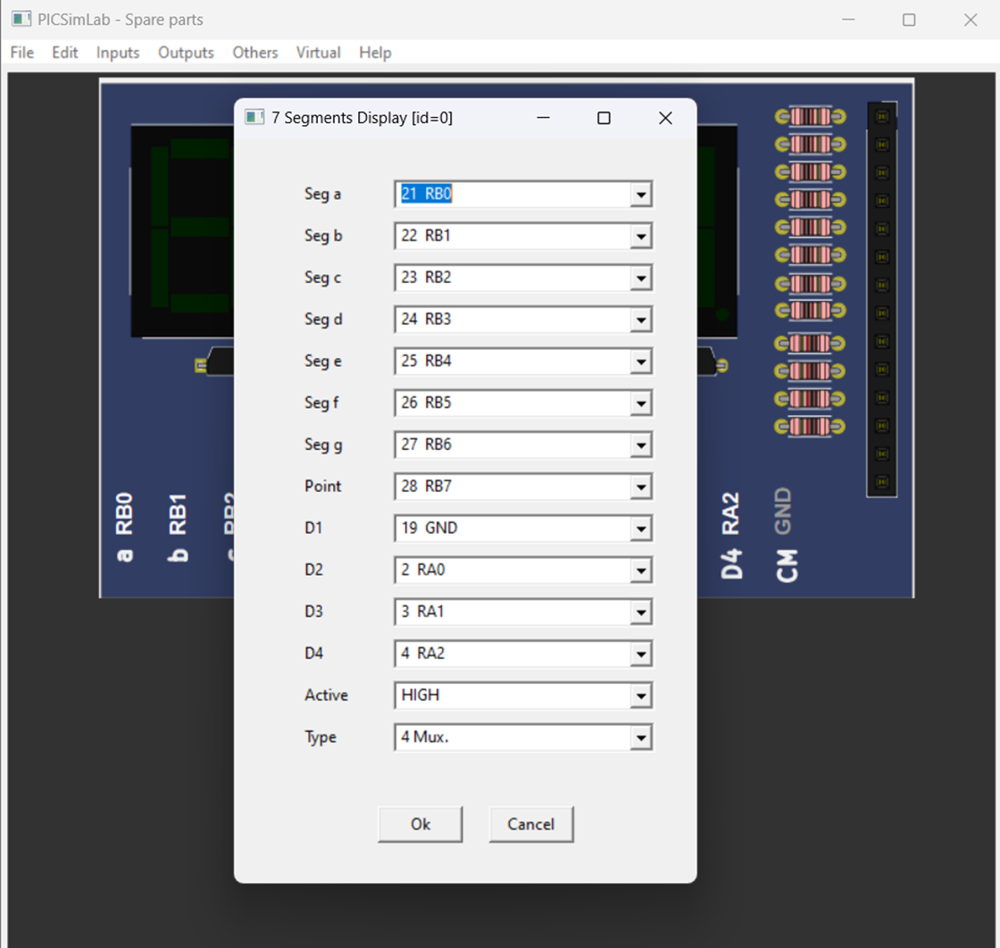

Em seguida, vá até opcão `File` e selecione `Load Hex`:

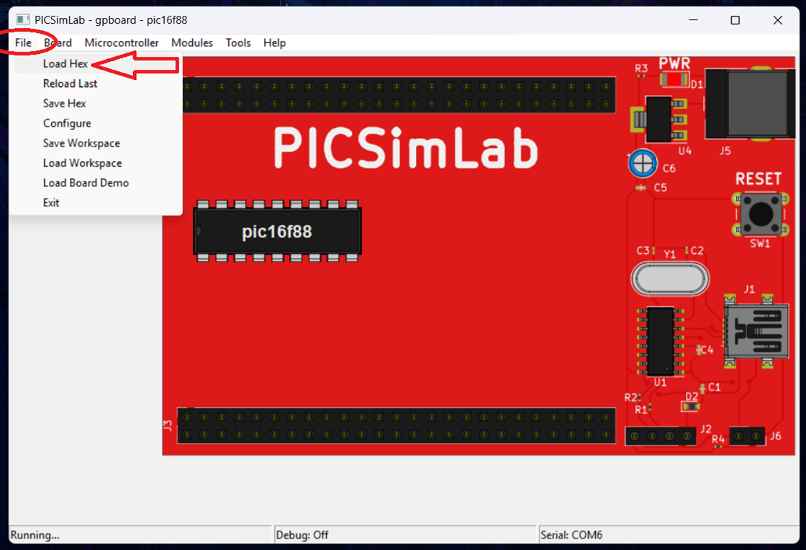

Depois disso, navegue até o local onde seu projeto está salvo e selecione a pasta `Seu-projeto/dist/default/production` para abri-la. E selecione o arquivo `.hex`, que provavelmente estará nomeado como `Seu-projeto.hex`, e clique para abrir:

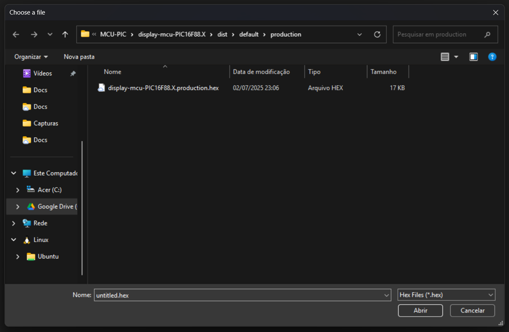

Se tudo estiver configurado adequadamente, o `display de 7 segmetos` é para funiconar:

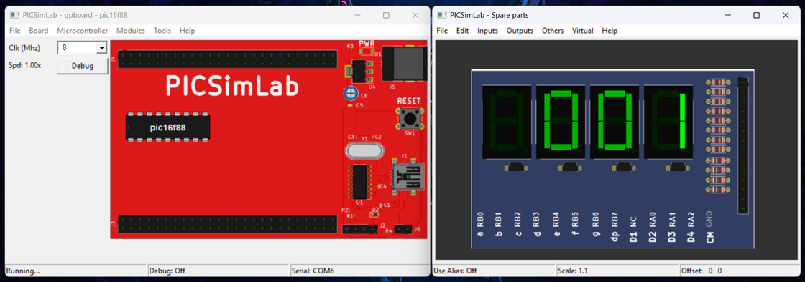

PICSimLab já esta configurado para poder usar, aqui;

[Display-7.pzw](Simulador/Display-7.pzw)

[Display-7.pcf](Simulador/Display-7.pcf)

## Bibliotecas

A biblioteca foi projetada para controlar um display de 7 segmentos com três dígitos, exibindo números decimais. Ela é composta por funções que inicializam o display, limpam os dígitos, e exibem valores. A multiplexação é usada para alternar entre os três dígitos, de modo que o display pareça mostrar os três dígitos simultaneamente.

1. **`void display_inicializar(void)`**
    
    Esta função é responsável por configurar o hardware do display de 7 segmentos. Ela define os pinos dos segmentos (a, b, c, d, e, f, g e ponto) e dos dígitos (Q1, Q2, Q3) como saídas. Isso é feito para garantir que os pinos corretos possam ser utilizados para controlar o display. Além disso, o display é inicializado apagando todos os dígitos.
    
    Exemplo de uso:
    
    ```c
    display_inicializar();
    ```
    
2. **`void display_limpar(void)`**
    
    Esta função apaga qualquer valor atualmente exibido no display. Ela desliga todos os segmentos e os dígitos, fazendo com que o display fique em branco. É útil para garantir que nenhum valor residual permaneça no display antes de exibir um novo número.
    
    Exemplo de uso:
    
    ```c
    display_limpar();
    ```
    
3. **`void display_exibir_numero(int numero)`**
    
    Esta função exibe um número inteiro no display de 7 segmentos. O número fornecido é separado em dígitos (unidades, dezenas, centenas, etc.), e cada dígito é exibido em uma posição específica do display através de multiplexação. Ela é ideal para exibir valores inteiros, sem casas decimais.
    
    Exemplo de uso:
    
    ```c
    display_exibir_numero(123);
    ```
    
4. **`void display_exibir_digito(uint8_t digito, uint8_t posicao)`**
    
    Esta função exibe um único dígito em uma posição específica do display. Ela é usada internamente pelas outras funções para controlar qual dígito aparece em qual posição. A função converte o número fornecido para o padrão de segmentos correspondente e o ativa na posição desejada.
    
    Exemplo de uso:
    
    ```c
    display_exibir_digito(5, 1);  // Exibe o número 5 na posição 1
    ```
    
5. **`void display_exibir_decimal(float numero)`**
    
    Esta função exibe um número decimal no display de 7 segmentos. Ela separa a parte inteira e a parte decimal do número e exibe ambas no display. O ponto decimal é ativado entre as casas decimais. Ela é ideal para exibir valores com uma ou duas casas decimais.
    
    Exemplo de uso:
    
    ```c
    display_exibir_decimal(12.34);
    ```
    

## Configuração do Firmware

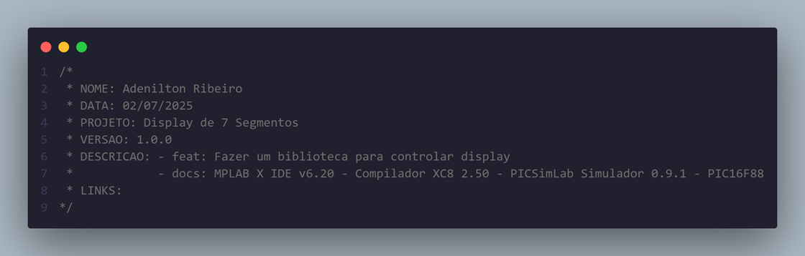

Essas funções trabalham juntas para permitir que você exiba tanto números inteiros quanto decimais. Aqui está um exemplo simples de como usar essas funções em um projeto:

```c
void main(void) {
    // Inicializa o display
    display_inicializar();

    // Exibe um número inteiro
    display_exibir_numero(25);

    // Pausa por alguns segundos
    __delay_ms(2000);

    // Exibe um número decimal
    display_exibir_decimal(1.23);

    while (1) {
        // Loop principal do programa
    }
}
```

### Adicionando a Biblioteca ao Projeto

Para adicionar essa biblioteca ao seu projeto, siga os mesmos passos que expliquei anteriormente:

1. **Arquivo de Cabeçalho (`display7.h`)**: Declare essas funções no arquivo de cabeçalho.
2. **Arquivo de Implementação (`display7.c`)**: Implemente as funções descritas.
3. **Incluir a Biblioteca no Projeto**: No arquivo principal do seu projeto, adicione `#include "display7.h"` para usar essas funções.

## Informações

| Info        | Modelo             |
|-------------|--------------------|
| uC          | PIC16F88           |
| Placa       | PICSimlab v0.9.1   |
| Arquitetura | RISC               |
| IDE         | MPLAB X IDE v6.20  |
| Compilador  | XC8 v2.46          |