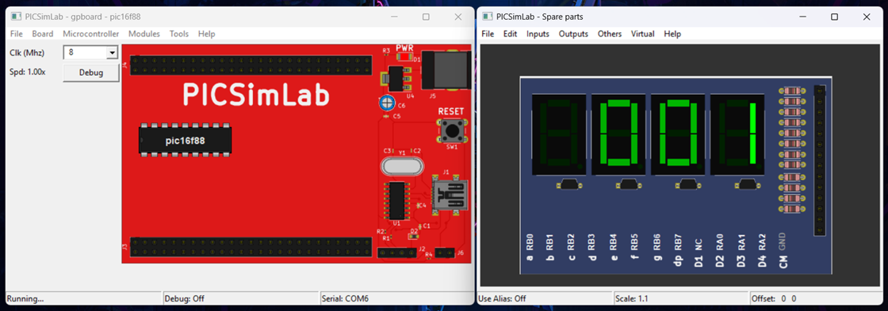

# _Biblioteca Multiplexação de Display Portável para MCU_

---

## Sumário

- [Histórico de Versão](#histórico-de-versão)
- [Boas Práticas para Commits](#boas-práticas-para-commits)
- [Resumo](#resumo)
- [Objetivo](#objetivo)
- [Requisitos](#requisitos)
    - [Hardware](#hardware)
    - [Software](#software)
    - [Pré-requisitos](#pré-requisitos)
    - [Multiplexação de Displays de Sete Segmentos](#multiplexação-de-displays-de-sete-segmentos)
    - [Como Funciona a Multiplexação](#como-funciona-a-multiplexação)
    - [Vantagens da Multiplexação](#vantagens-da-multiplexação)
    - [Desafios da Multiplexação](#desafios-da-multiplexação)
    - [Implementação no Projeto](#implementação-no-projeto)
- [Informações Adicionais](#informações-adicionais)
    - [Firmware PIC](#firmware-pic)
    - [Firmware 8051](#firmware-8051)
    - [Firmware STM8](#firmware-stm8)
    - [Firmware STM32](#firmware-stm32)
    - [Firmware ESP32](#firmware-esp32)
    - [Firmware AVR](#firmware-avr)

## Histórico de Versão

| Versão | Data       | Autor       | Descrição         |
|--------|------------|-------------|-------------------|
| 1.0.0  | 02/07/2025 | Adenilton R | Início do Projeto |

## Resumo

Este projeto tem como objetivo desenvolver uma biblioteca em C puro para controlar displays de sete segmentos por multiplexação, permitindo que o código seja facilmente portado para diversas plataformas de microcontroladores, como PIC, 8051, STM8, STM32, ESP32 e AVR. A biblioteca foi projetada para ser independente do hardware específico e configurável em diferentes IDEs, sendo uma solução modular e reutilizável para quem busca desenvolver aplicações embarcadas com múltiplos displays. Além disso, o repositório inclui exemplos práticos e simulações no PICSimLab, facilitando o uso e a adaptação do código em ambientes de desenvolvimento variados.

## Objetivo

O objetivo principal deste projeto é criar uma biblioteca modular e de fácil portabilidade em linguagem C para controle de displays de sete segmentos utilizando multiplexação. Os objetivos específicos incluem:

- Desenvolver uma biblioteca que seja compatível com diversos microcontroladores e IDEs populares no mercado.
- Documentar o processo de configuração e uso da biblioteca para microcontroladores PIC, 8051, STM8, STM32, ESP32 e AVR.
- Fornecer exemplos de código e arquivos de simulação no PICSimLab para facilitar a validação do projeto em diferentes plataformas.
- Facilitar o aprendizado e a aplicação do controle de displays multiplexados em projetos de sistemas embarcados, promovendo o uso de boas práticas em desenvolvimento portável em C.

## Requisitos

Para executar este projeto, os seguintes requisitos de hardware e software são necessários:

### Hardware

- Microcontroladores: PIC, 8051, STM8, STM32, ESP32, e AVR.
- Circuito de multiplexação para três displays de sete segmentos.
- Componentes eletrônicos: resistores, transistores e displays de sete segmentos.

### Software

- IDEs específicas para cada microcontrolador:
    - **MPLAB X** para PIC.
    - **MicroC 8051** para 8051.
    - **STM8 Cosmic/Cosmic IDE** para STM8.
    - **STM32CubeIDE** para STM32.
    - **ESP-IDF** para ESP32.
    - **AVR Studio** para AVR.
- **PICSimLab** para simulação do circuito e testes com diferentes microcontroladores.

### Pré-requisitos

- Conhecimento básico de programação em C e conceitos de multiplexação de displays.
- Familiaridade com o uso de IDEs e simuladores de microcontroladores.

### Multiplexação de Displays de Sete Segmentos

A multiplexação de displays de sete segmentos é uma técnica utilizada para controlar múltiplos displays com um número reduzido de pinos de saída do microcontrolador, economizando recursos e simplificando o circuito. Em vez de acionar todos os segmentos de todos os displays simultaneamente, a multiplexação aciona um display por vez em uma sequência rápida. Essa alternância é rápida o suficiente para que os displays pareçam estar acesos continuamente aos olhos humanos, aproveitando o fenômeno da persistência da visão.

### Como Funciona a Multiplexação

Em um sistema de multiplexação, cada display é conectado aos mesmos pinos de controle dos segmentos (a, b, c, d, e, f, g), enquanto os cátodos (ou ânodos, dependendo do tipo de display) são controlados individualmente por transistores ou diretamente pelo microcontrolador. O processo básico de multiplexação envolve três etapas principais:

1. **Atualização do Dígito**: O microcontrolador define o valor do dígito que deve ser exibido no display, acionando os pinos dos segmentos correspondentes ao número desejado.
2. **Habilitação do Display**: Após definir o dígito, o microcontrolador habilita apenas o display correspondente, acendendo-o temporariamente.
3. **Troca de Display**: O microcontrolador desabilita o display atual, atualiza o valor para o próximo dígito e habilita o próximo display. Esse ciclo continua para cada display na sequência.

Esse processo de troca rápida permite que cada display mostre o valor correspondente, parecendo estar todos acesos simultaneamente.

### Vantagens da Multiplexação

- **Economia de Pinos**: Como os segmentos são compartilhados entre os displays, é possível reduzir o número de pinos necessários para o controle. Por exemplo, em vez de precisar de 21 pinos para controlar três displays de sete segmentos (7 segmentos por display), um sistema multiplexado pode operar com apenas 10 pinos (7 para os segmentos e 3 para habilitação de cada display).
- **Redução de Consumo de Energia**: Com a multiplexação, apenas um display é acionado por vez, reduzindo o consumo total de energia, o que pode ser vantajoso em sistemas com restrições de energia.

### Desafios da Multiplexação

- **Velocidade de Atualização**: Para que a multiplexação funcione sem cintilação visível, o microcontrolador deve alternar entre os displays em uma frequência suficientemente alta, geralmente entre 50 Hz e 100 Hz. Isso exige um controle preciso do tempo e pode consumir ciclos de CPU, especialmente em microcontroladores com baixa velocidade de processamento.
- **Codificação do Controle de Dígitos**: Como cada dígito precisa ser configurado e exibido em sequência, o código precisa de uma lógica para armazenar e atualizar os valores a serem exibidos em cada display.

### Implementação no Projeto

Neste projeto, a multiplexação será implementada em uma biblioteca em C que será utilizada para controlar três displays de sete segmentos, garantindo portabilidade para diferentes microcontroladores, incluindo PIC, 8051, STM8, STM32, ESP32 e AVR.

## Informações Adicionais

### Firmware PIC

Para obter mais informações sobre o projeto do Firmware, clique no [**link**](https://github.com/AdeniltonR/Biblioteca-Multiplexacao-Display-Portavel-MCU/tree/main/Projetos/MCU-PIC) a seguir.

### Firmware 8051

Para obter mais informações sobre o projeto do Firmware, clique no [**link**](https://github.com/AdeniltonR/Biblioteca-Multiplexacao-Display-Portavel-MCU/tree/main/Projetos/MCU-8051) a seguir.

`[Adicionar uma foto ou Gif]`

### Firmware STM8

Para obter mais informações sobre o projeto do Firmware, clique no [**link**](https://github.com/AdeniltonR/Biblioteca-Multiplexacao-Display-Portavel-MCU/tree/main/Projetos/MCU-STM8) a seguir.

`[Adicionar uma foto ou Gif]`

### Firmware STM32

Para obter mais informações sobre o projeto do Firmware, clique no [**link**](https://github.com/AdeniltonR/Biblioteca-Multiplexacao-Display-Portavel-MCU/tree/main/Projetos/MCU-STM32) a seguir.

`[Adicionar uma foto ou Gif]`

### Firmware ESP32

Para obter mais informações sobre o projeto do Firmware, clique no [**link**](https://github.com/AdeniltonR/Biblioteca-Multiplexacao-Display-Portavel-MCU/tree/main/Projetos/MCU-ESP32) a seguir.

`[Adicionar uma foto ou Gif]`

### Firmware AVR

Para obter mais informações sobre o projeto do Firmware, clique no [**link**](https://github.com/AdeniltonR/Biblioteca-Multiplexacao-Display-Portavel-MCU/tree/main/Projetos/MCU-AVR) a seguir.

`[Adicionar uma foto ou Gif]`